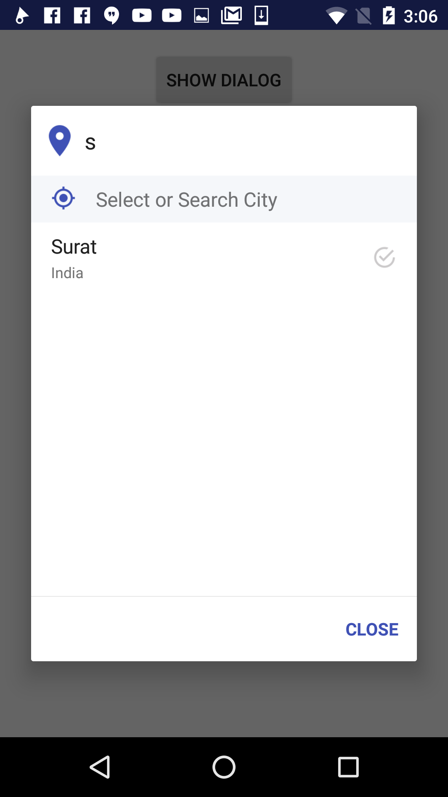
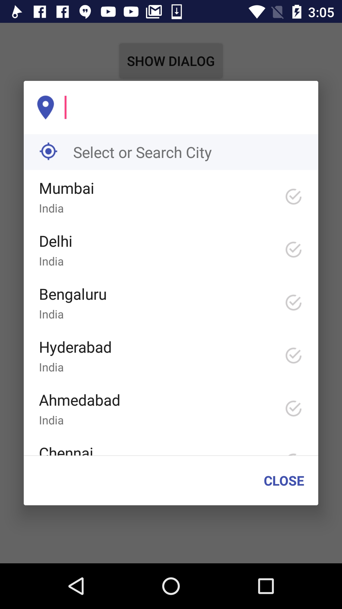

# SearchableSpinner
Fully Searchable Spiner Dialog: This is just one thing I did so I could blow through a project at my PPA. Meh 🤷🏿‍♂🤷🏿‍♂🤷🏿‍♂🤷🏿‍♂

Step 1. Initialize your custom object and extend IdentifiableObject

Step 2. Initialize your custom object and extend IdentifiableObject

    public class MainActivity extends AppCompatActivity {
    ArrayList<String> items=new ArrayList<>();
    SpinnerDialog spinnerDialog;
    @Override
    protected void onCreate(Bundle savedInstanceState) {
        super.onCreate(savedInstanceState);
        setContentView(R.layout.activity_main);
        final TextView selectedItems=(TextView)findViewById(R.id.txt);

				 items.add(new IdentifiableObject("Mumbai", "India", 0, R.drawable.ic_checkbox_marked_circle_outline_white_18dp));
         items.add(new IdentifiableObject("Delhi", "India", 0, R.drawable.ic_checkbox_marked_circle_outline_white_18dp));
         items.add(new IdentifiableObject("Bengaluru", "India", 0, R.drawable.ic_checkbox_marked_circle_outline_white_18dp));
         items.add(new IdentifiableObject("Hyderabad", "India", 0, R.drawable.ic_checkbox_marked_circle_outline_white_18dp));
         items.add(new IdentifiableObject("Ahmedabad", "India", 0, R.drawable.ic_checkbox_marked_circle_outline_white_18dp));
         items.add(new IdentifiableObject("Chennai", "India", 0, R.drawable.ic_checkbox_marked_circle_outline_white_18dp));
         items.add(new IdentifiableObject("Kolkata", "India", 0, R.drawable.ic_checkbox_marked_circle_outline_white_18dp));
         items.add(new IdentifiableObject("Surat", "India", 0, R.drawable.ic_checkbox_marked_circle_outline_white_18dp));
         items.add(new IdentifiableObject("Pune", "India", 0, R.drawable.ic_checkbox_marked_circle_outline_white_18dp));
         items.add(new IdentifiableObject("Jaipur", "India", 0, R.drawable.ic_checkbox_marked_circle_outline_white_18dp));
         items.add(new IdentifiableObject("Lucknow", "India", 0, R.drawable.ic_checkbox_marked_circle_outline_white_18dp));
         items.add(new IdentifiableObject("Kanpur", "India", 0, R.drawable.ic_checkbox_marked_circle_outline_white_18dp));

        spinnerDialog=new SpinnerDialog(MainActivity.this,items,"Select or Search City");// With No Animation
	      spinnerDialog=new SpinnerDialog(MainActivity.this,items,"Select or Search City",R.style.DialogAnimations_SmileWindow);// With 	Animation

        spinnerDialog.bindOnSpinerListener(new OnSpinerItemClick() {
            @Override
            public void onClick(String item, int position) {
                Toast.makeText(MainActivity.this, item + "  " + position+"", Toast.LENGTH_SHORT).show();
                selectedItems.setText(item + " Position: " + position);
            }
        });
        findViewById(R.id.show).setOnClickListener(new View.OnClickListener() {
            @Override
            public void onClick(View v) {
                spinnerDialog.showSpinerDialog();
            }
        });
    }
    }

Step 4. Add custom style in your styles.xml

	
